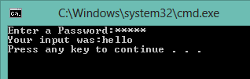
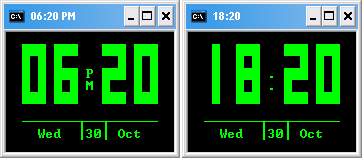

# Batch

There are codes and articles about windows batch programming.

## Password Input

This script allow you enter a password, showing `*` (mark) instead of the key pressed.



## Batch Clock

This script shows a digital clock.



## Create all ansi characters

Is possible create all ansi characters using a batch script?

Yes. There are several methods.

For example you need create the `tab` character or even the `nul` character.

Note: the `nul` character is the `ansi 0`, and is different from the `NUL` file
used in `cmd.exe` that is a special file that not have any character.

For create any ansi character we can use a technique using `makecab`.
This will works from windows 2000 to windows 8.

Use genchr.cmd like this:
```
genchr.cmd 0
rem this will create the 0 or nul character.
genchr.cmd 9
rem this will create the 9 or tab character.
```

The files will have the `.chr` extension.

If you need create large binary data look [bhx program](../bhx)
