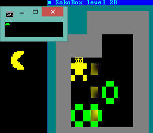

# BG v3.9 se - BatchGraphics

BG is a utility and also a collection of programs for `cmd.exe`. With it you can write character graphics, make mini batch games, print text in color and also play sounds. Originally it was only one program, but now, it relies some functions in separated executables.

The collection of utilities are 5 programs:

`bg.exe` - Tool for print text color in `cmd.exe`. It accepts regular expressions for print ascii characters. It also have useful functions.

`sound.exe` - Tool for play sound files in format `.wav` from `cmd.exe`. You can play sounds and also stop it. A sound is stop automatically when the `cmd.exe` window that launch the command is closed. Also when you use the argument stop.

`pixelfnt.exe` - Tool for load in the current windows session for cmd.exe a raster font of `1x1`, `2x2`, `3x3` pixels and set it.

`sprite.exe` - Tool for draw on the console screen a sprite file created with `editor.exe`

`editor.exe` - Tool for create sprites for draw with `sprite.exe`.



## Changelog:

```
v3.9 se
        : BG code reviewed. Same speedy, smaller executable.
          FCPrint function:
          - Uses row as first argument according to the documentation.
          - Accept row and column values outside the console screen buffer, like -1.
          Location function:
          - Row and col values are adjusted to be inside the screen buffer.

v3.9   :  Added game SokoBox v1.4.
          OEM Escape sequences are converted to Unicode before print.
          New functions: FCPrint, Play.
          In Mouse and Locate functions: row and column values now are zero index based.

v3.8.1 :  Updated example_1.cmd.

v3.8   :  Minor changes to the source code.

v3.5   :  Sprite.exe now internally uses an associative array.
          Bugfix: bg.exe font function now works ok on windows 10.

v3.4   :  Minor changes on bg.exe and pixelfnt.exe.

v3.3   :  Bugfix: pixelfnt.exe now works ok on windows xp and windows 8.
          Minor changes: bg.exe, sprite.exe.
          Most of the executables recompiled for run more speedy.
```

Download bg39.zip with contains executables, documentation and sources

```
bg39.zip info:

File:		bg39.zip
Size:		109622 bytes
SHA-256:	187167dc5bebac16c87f9f3f2028ae9a62ce57dad2dfd9aa640edd7f08ec94fa

Files inside bg39.zip info:

File:		bg.exe
Size:		9728 bytes
SHA-256:	8d632c383aaa4089fbcc5f4e99553264463d0e52dddf00211885dadc23217c7f

File:		pixelfnt.exe
Size:		7680 bytes
SHA-256:	cfacad7d3e7bccff6539390302e652f354988808a56f43fe66177ccea8d7d6b9

File:		sound.exe
Size:		5120 bytes
SHA-256:	1edcfa27df6f115a09f1dd599d9a4c8599342e82d2402565154017fdd76f2f90

File:		sprite.exe
Size:		7168 bytes
SHA-256:	d282631599674019c159a05df09f756d6169c81f4e959ee4968e7731578b6556

File:		editor.exe
Size:		18831 bytes
SHA-256:	0903f6177af6430c2156118eaf801f360a138ae9218b3cc485174fd4a08b5366
```
