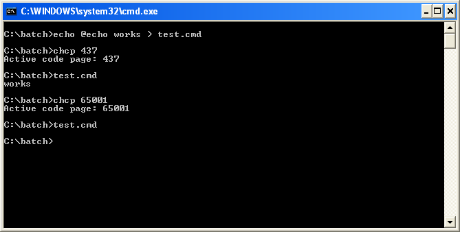
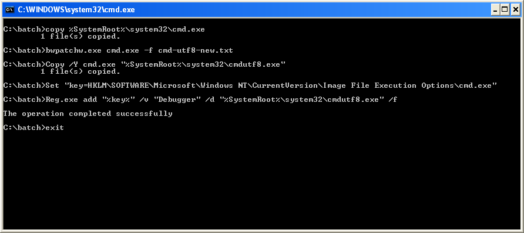
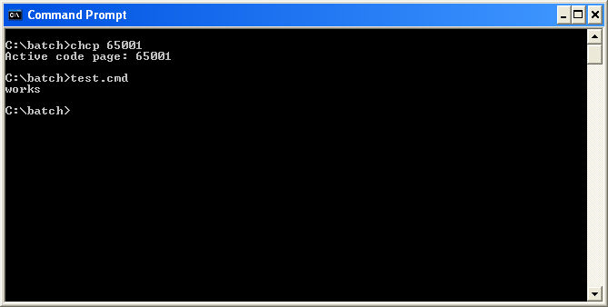

_Base on https://web.archive.org/web/20180902083530/http://consolesoft.com/p/cmd-xp-65001-fix/index.html_

# Cmd XP 65001 Fix

`Cmd.exe` for windows XP, originally cannot run a batch script file when it uses the codepage `65001 (UTF-8)`.

The problem was solved in the version for windows 7. The cause of this is when `cmd.exe` for windows xp internally call to the function `MultiByteToWideChar` using the argument `dwFlags` with the value `1`. The documentation says this:

  _For UTF-8 dwFlags must be set to 0. Otherwise, the function fails._

For solve this, a patch was created (by Jason Hood) that implements the functionality used in the version for windows 7, that consist on determine dwFlags according the code page. 

Note: this patch is for the version _5.1.2600.5512_ (this comes with the service pack 3).

For patching it you need:

 * Download [the archive cmd_xp_65001_fix.zip](https://github.com/carlos-montiers/consolesoft-mirror/releases/download/20180921/cmd_xp_65001_fix.zip)
 * Unzip it
 * `cd` to the newly created directory `cmd_xp_65001_fix`
 * Run the batch script `cmd-cmdutf8-replace.bat`

Now every time the systems run `cmd.exe` it will run `cmdutf8.exe` as if it were `cmd.exe`. This option is used because if you replace the original `cmd.exe` with the patched `cmd.exe` windows will restore it (because it protect the system files from modifications). This solution is really functional.

Now, if you run the command prompt it will internally use `cmdutf8.exe`.

Very thanks to Jason Hood for all the help with this patch solution.

Some facts:

 * Original bwpatch: http://adoxa.altervista.org/misc/#bwpatch
 * The commands of the batch script were supplied by Jason Hood
 * `cmd-xp-new.asm` is the source of the patch to be used with multiasm plugin for ollydbg 2.01
