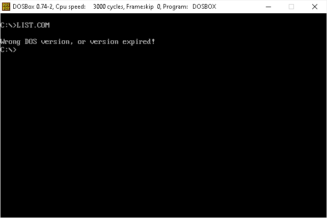
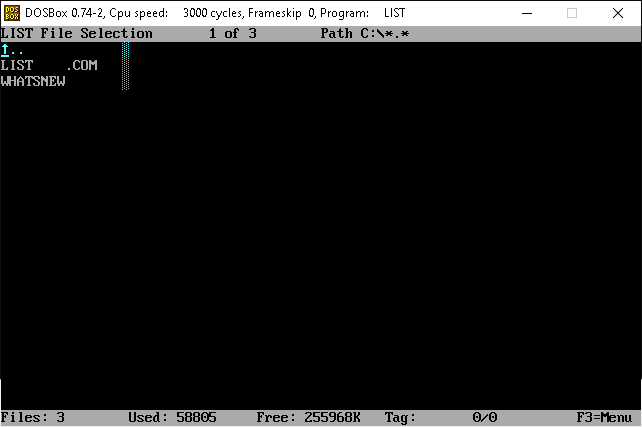
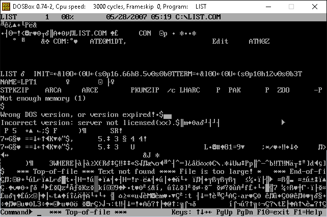
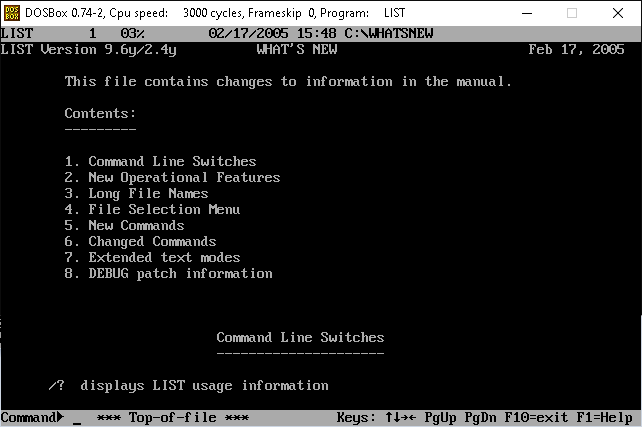
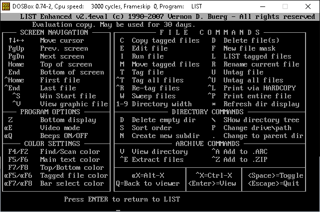

# LIST ENHANCED

## LIST Enhanced 2.4y1 (Patch for run on Dosbox)
I found in an old cd a pretty cool file viewer for MS-DOS called: LIST 9.0b 08/24/93 by Vernon D. Buerg.

I search for more information about this tool and I found two things:

1) LIST.COM was a famous tool.

2) The author passed away in 2009, accordingly to the information on this page (archived):
https://web.archive.org/web/20161107235834/https://www.dwwatkins.com/in-memory-of-vern-buerg.htm

The program comes in two versions: Plus and Enhanced.

You can get the last (archived) LIST Plus version 9.6y1 here:
https://web.archive.org/web/20070720001459/http://www.buerg.com/downloads/listplus.zip

You can get the last (archived) LIST Enhanced version 2.4y1 here:
https://web.archive.org/web/20070720002157/http://www.buerg.com/downloads/listeval.zip

The Enhanced version comes with more features than Plus version, like view ASCII, hex, or EBCDIC files up to 500mb.

If you try run this version on dosbox is impossible because the program verify the DOS version and dosbox is not DOS.
If you run on dosbox it says:
Wrong DOS version, or version expired!

If you run on MS-DOS on a virtual machine it says the same if you not run this command:
DATE
1/1/2007

Because I want use it comfortably on dosbox and
because is not possible buy it anymore I asked for help to patch these things for my personal usage.

Jason Hood provides a patch for the version 2.4y1.

Note: This patch not intend replace a fully registered version, only allow run it on dosbox.

Steps for apply the patch:

 * Download [the archive liste-dosbox.zip](https://github.com/carlos-montiers/consolesoft-mirror/releases/download/20180921/liste-dosbox.zip)
 * Unzip it
 * `cd` to the newly created directory `liste-dosbox`
 * Run the batch script `liste-dosbox-patch.bat`
 * Now you can run LIST.COM on Dosbox

